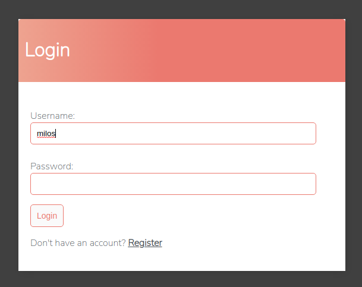
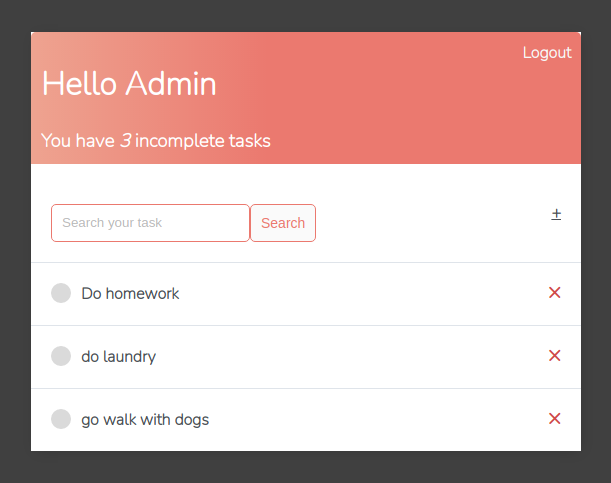
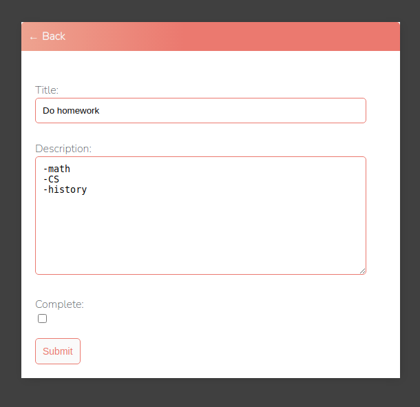

# ToDo-App
Simple ToDo App build with Django

## Features
- task CRUD functionality
- user authentication system

## 🛠 Skills
<p align="left">  
    <a href="https://www.python.org" target="_blank" rel="noreferrer">  </a>
    <a href="https://www.djangoproject.com/" target="_blank" rel="noreferrer">  </a> 
    <a href="https://www.w3.org/html/" target="_blank" rel="noreferrer">  </a>
    <a href="https://www.w3schools.com/css/" target="_blank" rel="noreferrer">  </a>

</p>

## Preview




    
## Requirements
* python>=3

## Installation
Firstly, clone the repository from the github to your local folder with the following command:
```
git clone https://github.com/Milosz-cat/Todo-App.git
```
Create and start a a virtual environment:
```
python -m venv env
```
```
source env/bin/activate      # On Windows use `env\Scripts\activate`
```
Install the project dependencies:
```
pip install -r requirements.txt
```
This will create all the migrations file (database migrations) required to run this project:
```
python manage.py makemigrations
```
Now, to apply this migrations run the following command:
```
python manage.py migrate
```
Now we need to create admin user:
```
python manage.py createsuperuser
```
And finnaly we can run our local server:
```
python manage.py runserver
```
Once the server is hosted, head over to http://127.0.0.1:8000/
